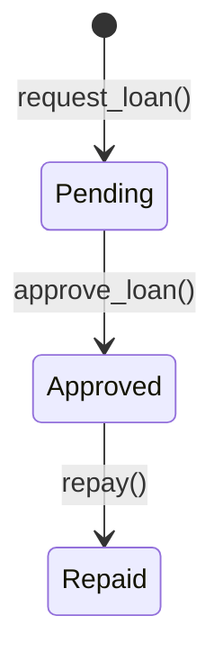

# Contributing to RemitLend Docs

Thank you for helping improve RemitLend documentation! This guide explains how to add or edit docs and what to expect during review.

## Overview

- Docs live in this repo and are reviewed via PRs
- Technical docs go in `wiki/` for architectural and system design content
- Design docs go in the root for UI/UX and high-level product design
- All changes must maintain consistency in style, structure, and tone

## Before You Start

1. **Check existing docs** – Search `wiki/` and root for related documentation to avoid duplication
2. **Determine doc type** – Is this a reference guide (system architecture, state machines), how-to (processes, workflows), or design doc?
3. **Use a template** – See [templates](#templates) below

## Adding or Editing Docs

### Step 1: Create a Branch

```bash
git checkout -b docs/brief-title
```

### Step 2: Write Your Content

- Use [Markdown](#markdown-style-guide)
- Follow the [style guide](#style-guide) for consistency
- Reference the appropriate [template](#templates)

### Step 3: Submit a PR

- Use a clear title: `docs: add [topic]` or `docs: update [topic]`
- Reference any related issues or discussions
- Ping a reviewer for feedback

### Step 4: PR Review & Merge

- **Reviewers check for**: clarity, structure, style consistency, diagram accuracy, and broken links
- **No approval blocking** – docs are encouraged; we iterate on clarity
- Once approved, merge to `main`

## Style Guide

### Markdown Headings

- Use `#` for the main title (one per doc)
- Use `##` for major sections
- Use `###` and deeper for subsections
- Avoid skipping levels (no `#` then `###`)

**Example:**

```markdown
# Loan Lifecycle State Machine

## Overview

Brief intro to the topic.

### Pending State

Details about pending state.

## See Also

Related docs.
```

### Code Blocks

- Use triple backticks with language specifier
- For JSON, use `json`; for Solidity/Rust, use `rust` or specify the language
- Keep code examples concise and annotated

**Example:**

````markdown
```json
{
  "borrower": "GXXXXXX",
  "amount_usdc": 1000,
  "status": "Pending"
}
```
````

### Mermaid Diagrams

- Use Mermaid for flowcharts, state machines, and system architecture
- Keep diagrams focused on one concept
- Label nodes and edges clearly
- Prefer `stateDiagram-v2` for state machines and `graph TD` for flows

**Example:**

````markdown

````

### Links

- **Internal links**: Use relative paths (e.g., `./contract-state-machine.md` for wiki docs, `./DESIGN.md` for root docs)
- **External links**: Use full URLs with descriptive text
- Test links before submission

**Example:**

```markdown
See [Contract State Machine](./wiki/contract-state-machine.md) for details.
Learn more at [Soroban Docs](https://developers.stellar.org/docs/learn/storing-data).
```

### Lists

- Use `-` for unordered lists
- Use `1.` for ordered lists
- Maintain consistent indentation

**Example:**

```markdown
## Key Features

- Feature A
- Feature B
  - Sub-feature B1
  - Sub-feature B2

## Steps

1. First step
2. Second step
   1. Sub-step
```

### Line Length

- Aim for 100 characters per line for readability
- Break long sentences into separate lines

### Emphasis

- Use `**bold**` for important terms and first mentions
- Use `code` for technical terms, variable names, and commands
- Use `> blockquotes` for notes or important callouts

**Example:**

```markdown
The **Reliability Score** is calculated from on-chain repayment history. Use `get_score()` to retrieve it.

> **Note:** Only active loans count toward the score.
```

## Templates

### Reference Page Template

Use this for technical architecture, state machines, and system descriptions.

```markdown
# [Topic Name]

## Overview

Brief (2–3 sentence) explanation of what this document covers.

## Key Concepts

Define important terms or components.

## [Section Title]

Details, code examples, or diagrams.

## Diagram (if applicable)

\`\`\`mermaid
stateDiagram-v2
[Your diagram here]
\`\`\`

## See Also

- [Related Doc](./related-doc.md)
- [External Resource](https://example.com)
```

### How-To Page Template

Use this for processes, workflows, and step-by-step guides.

```markdown
# How to [Task]

## Prerequisites

What do you need before starting?

## Steps

### 1. First Step

Explanation and code example if applicable.

### 2. Second Step

Continuation.

## Troubleshooting

Common issues and solutions.

## See Also

- [Related Doc](./related-doc.md)
```

### Design Doc Template

Use this for product, UI/UX, and high-level design decisions.

```markdown
# [Design Topic]

## Objective

What problem does this solve?

## Key Design Contributions

What are the main features or solutions?

### [Component/Feature Name]

Details, rationale, and visual descriptions.

## System Design

How do components fit together?

## See Also

- [Related Docs]
```

## Tone & Voice

- **Clear & Direct**: Write for developers and non-technical stakeholders. Avoid jargon without explanation.
- **Active Voice**: Use "The contract manages loans" instead of "Loans are managed by the contract."
- **Concise**: Use short sentences and break up long paragraphs.
- **Encouraging**: Docs are living resources. Improvement suggestions in PRs are welcome.

## Common Issues & Tips

| Issue                    | Solution                                               |
| ------------------------ | ------------------------------------------------------ |
| Link broken after rename | Update all references; test links before PR            |
| Diagram too complex      | Split into multiple smaller diagrams                   |
| Style inconsistent       | Check existing docs and follow their pattern           |
| Code example outdated    | Verify against current codebase; add dates if relevant |

## Questions?

- Check [wiki/README.md](./wiki/README.md) for existing docs
- Open a discussion issue if you have questions before writing
- Tag maintainers in your PR for guidance, or reach out on Telegram

---

**Happy documenting!** 📚
