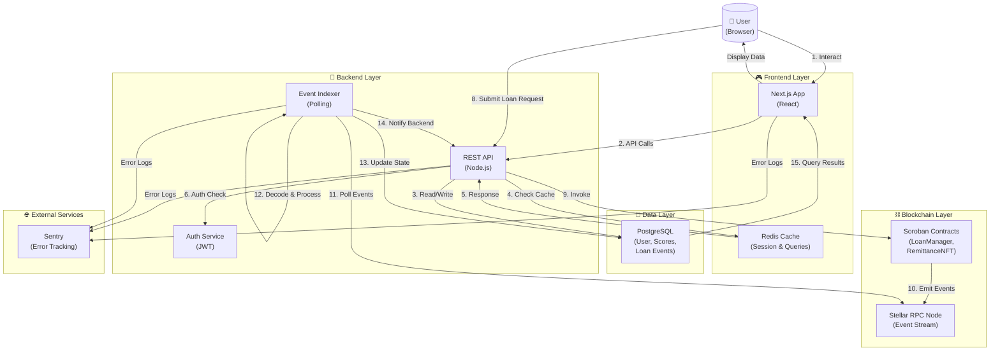
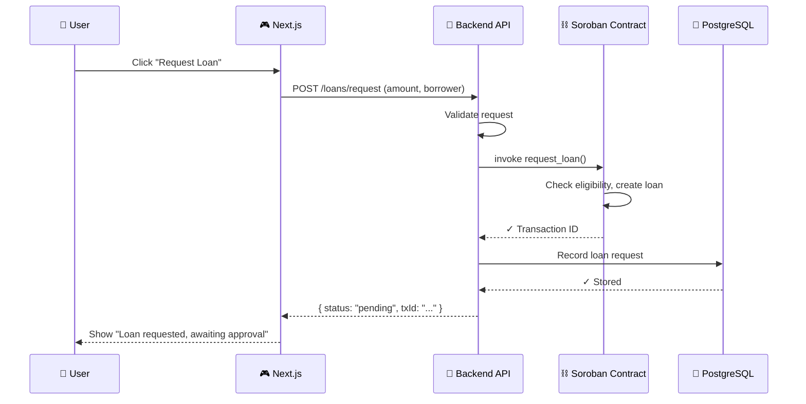
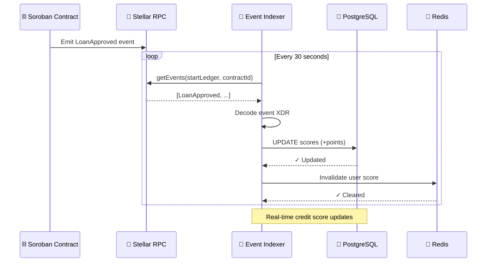
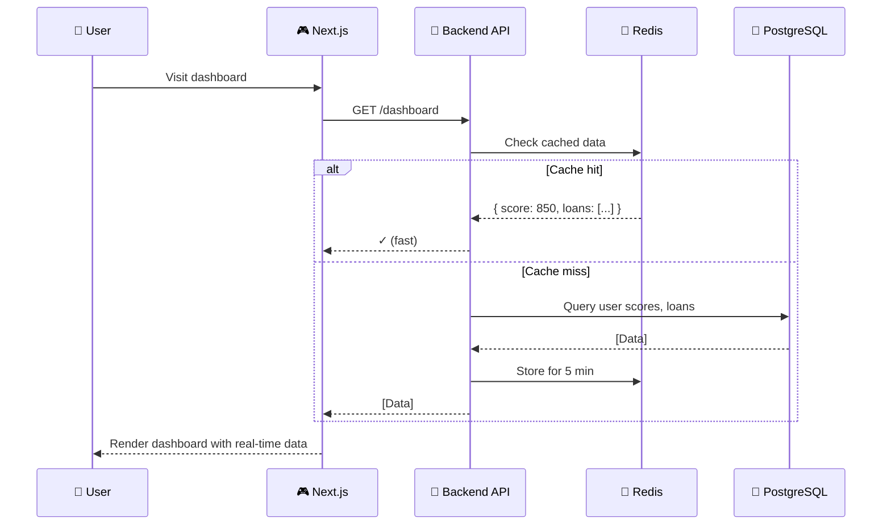

# System Architecture Overview

RemitLend is a DeFi gamification platform built on Stellar's Soroban smart contracts. This document provides a high-level overview of how all components interact to deliver loan management and credit scoring functionality.

## Architecture Diagram



## Component Descriptions

### Frontend Layer

- **Next.js App**: React-based UI that displays loan status, credit scores, quest progress, and kingdom tier information
- **Redis Cache**: Temporary storage for session data and frequently-queried results to reduce database load

### Backend Layer

- **REST API**: Node.js server handling user requests, authentication, loan operations, and real-time data queries
- **Auth Service**: JWT-based authentication for secure API access
- **Event Indexer**: Background service that continuously polls Stellar RPC for on-chain events and synchronizes them with the database

### Data Layer

- **PostgreSQL**: Primary database storing user profiles, credit scores, loan history, and indexed events

### Blockchain Layer

- **Soroban Contracts**: Smart contracts on Stellar that manage loan lifecycle (`LoanManager`) and user credit tracking (`RemittanceNFT`)
- **Stellar RPC Node**: Provides access to contract events and allows transaction submission

### External Services

- **Sentry**: Error tracking and monitoring for all layers

## Data Flow Diagrams

### Request Flow (User Action → Contract)



### Event Processing Flow (On-Chain → Database)



### User Dashboard Load (Frontend → Database)



## Trust Boundaries

```mermaid
graph LR
    Internet["🌐 Internet<br/>(Untrusted)"]
    FrontendUser["🎮 Frontend +<br/>User Browser<br/>(Semi-Trusted)"]
    Backend["🔧 Backend<br/>(Trusted)"]
    Contracts["⛓️ Soroban<br/>Contracts<br/>(Immutable)"]

    Internet -->|HTTPS| FrontendUser
    FrontendUser -->|JWT Token| Backend
    Backend -->|Invoke only<br/>after checks| Contracts

    note over Internet,FrontendUser: Trust Boundary #1<br/>Validated by HTTPS & JWT
    note over Backend,Contracts: Trust Boundary #2<br/>Soroban is source of truth
```

### Trust Boundaries Explained

1. **Internet ↔ Frontend**: SSL/TLS encryption; all API calls authenticated with JWT
2. **Frontend ↔ Backend**: JWT validation; backend enforces permissions before querying DB or contracts
3. **Backend ↔ Contracts**: Contracts are immutable source of truth; backend reads events, never overwrites contract state

## External Dependencies

| Dependency              | Purpose                                  | Risk                                                   |
| ----------------------- | ---------------------------------------- | ------------------------------------------------------ |
| **Stellar RPC Node**    | Access to contract events and state      | High availability required; fallback nodes recommended |
| **PostgreSQL Database** | Persistent storage of scores and history | Data consistency critical; backups required            |
| **Redis**               | Session cache and query result caching   | Performance optimization; loss is recoverable          |
| **Sentry**              | Error tracking and monitoring            | Optional but recommended for production                |

## Key Files & Documentation

- **[Contract State Machine](./contract-state-machine.md)** – Loan lifecycle and contract state transitions
- **[Indexer Sync Flow](./indexer-sync-flow.md)** – Detailed explanation of event polling and database synchronization
- **[Frontend Patterns](./frontend-patterns.md)** – React component conventions and reusable UI patterns
- **[DESIGN.md](../DESIGN.md)** – Product vision, UI/UX decisions, and visual design language

## Running the System Locally

Typically:

1. Start PostgreSQL (or connect to remote instance)
2. Start Stellar RPC (or use testnet/mainnet)
3. Deploy Soroban contracts to testnet
4. Start backend: `npm start` (runs API + indexer)
5. Start frontend: `npm run dev` (runs Next.js)

See each service's README for specific setup instructions.

## See Also

- [Soroban Documentation](https://developers.stellar.org/docs/learn/storing-data)
- [Stellar RPC API](https://developers.stellar.org/docs/data/rpc/api-reference)
- [RemitLend Wiki](./README.md)
