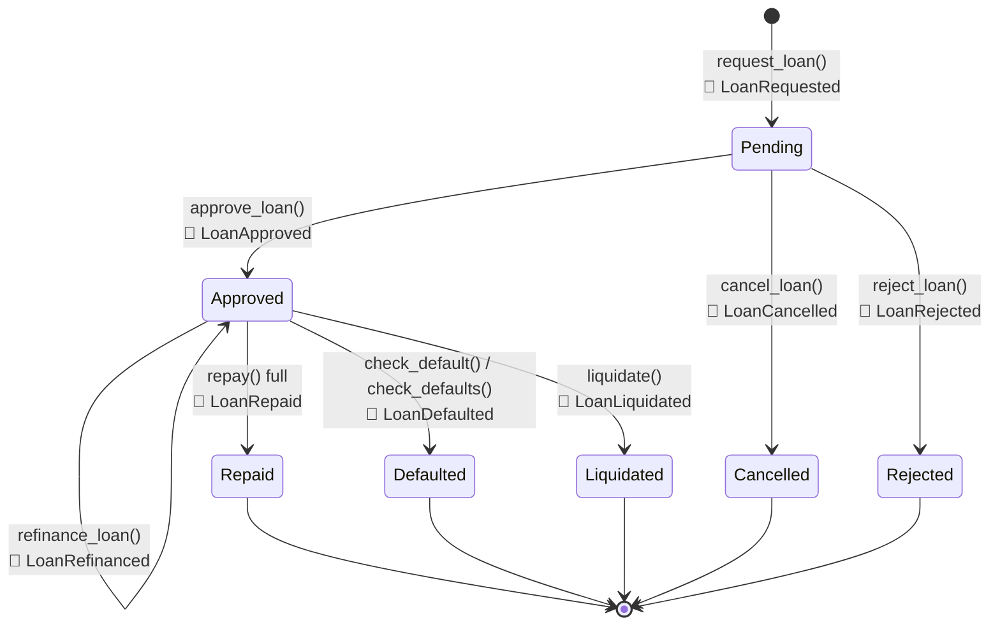

# Soroban Contract State Machine

This document details the state management and lifecycle of loans within the
`loan_manager` Soroban contract. All information is derived directly from
[`loan_manager/src/lib.rs`](https://github.com/LabsCrypt/remitlend-contracts/blob/main/loan_manager/src/lib.rs)
and
[`loan_manager/src/events.rs`](https://github.com/LabsCrypt/remitlend-contracts/blob/main/loan_manager/src/events.rs).

---

## LoanStatus enum

```rust
pub enum LoanStatus {
    Pending,     // loan requested, awaiting admin decision
    Approved,    // funds disbursed, repayment clock running
    Repaid,      // fully repaid (terminal)
    Defaulted,   // missed repayment window – admin-triggered (terminal)
    Liquidated,  // under-collateralised – liquidator-triggered (terminal)
    Cancelled,   // borrower withdrew before approval (terminal)
    Rejected,    // admin denied the request (terminal)
}
```

> **States that do not exist in the current contract:** `Open`, `Disputed`.
> These appeared in earlier design drafts but are not implemented.

---

## State diagram



---

## Transitions reference

### Pending ← `request_loan(borrower, amount, term)`

| Field | Detail |
|-------|--------|
| Auth | `borrower.require_auth()` |
| Paused gate | Yes – reverts with `ContractPaused` / `PoolPaused` / `NftPaused` |
| Pre-conditions | `amount > 0`, `amount ≤ MaxLoanAmount`, `term > 0`, credit score ≥ `MinScore`, borrower NFT not seized, active loan count < `MaxLoansPerBorrower` |
| Side-effects | Increments `LoanCounter`; increments `BorrowerLoanCount`; appends to `BorrowerLoans` |
| Event emitted | `LoanRequested(borrower, amount)` |

---

### Approved ← `approve_loan(loan_id)`

| Field | Detail |
|-------|--------|
| Auth | `admin.require_auth()` |
| Paused gate | Yes |
| Pre-conditions | Loan must be `Pending`; pool available liquidity ≥ `loan.amount` |
| Side-effects | Sets `due_date`, `last_interest_ledger`; transfers tokens from `LendingPool → borrower`; adjusts `TotalOutstanding` |
| Events emitted | `LoanApproved(loan_id, borrower, interest_rate_bps, term_ledgers)`, `LoanApprv` (short admin event) |

---

### Cancelled ← `cancel_loan(borrower, loan_id)`

| Field | Detail |
|-------|--------|
| Auth | `borrower.require_auth()` |
| Paused gate | No |
| Pre-conditions | Loan must be `Pending`; `loan.borrower == borrower` |
| Side-effects | Returns any posted collateral to borrower |
| Events emitted | `CollateralReturned` (if collateral > 0), `LoanCancelled(borrower, loan_id)` |

---

### Rejected ← `reject_loan(loan_id, reason)`

| Field | Detail |
|-------|--------|
| Auth | `admin.require_auth()` |
| Paused gate | No |
| Pre-conditions | Loan must be `Pending` |
| Side-effects | Returns any posted collateral to borrower |
| Events emitted | `CollateralReturned` (if collateral > 0), `LoanRejected(loan_id, reason)` |

---

### Repaid ← `repay(borrower, loan_id, amount)` (full repayment)

| Field | Detail |
|-------|--------|
| Auth | `borrower.require_auth()` |
| Paused gate | Yes |
| Pre-conditions | Loan must be `Approved`; `loan.borrower == borrower`; `amount > 0`; current ledger ≤ `due_date + DefaultWindowLedgers`; `amount ≤ total_debt` |
| Side-effects | Proportional split across principal / interest / late fees; decrements `BorrowerLoanCount`; adjusts `TotalOutstanding`; releases collateral back to borrower; cross-contract score update on NFT (`decrease_score` if late, `apply_score_delta` otherwise) |
| Events emitted | `LoanRepaid(borrower, loan_id, amount)`, `LateFeeCharged` (if late fee accrued), `CollateralReturned` |

Partial repayments (`amount < total_debt`) leave the loan in `Approved` and also emit `LoanRepaid`.

---

### Defaulted ← `check_default(loan_id)` / `check_defaults(loan_ids)`

| Field | Detail |
|-------|--------|
| Auth | `admin.require_auth()` |
| Paused gate | Yes |
| Pre-conditions | Loan must be `Approved`; current ledger > `due_date + DefaultWindowLedgers` |
| Side-effects | Seizes collateral (transfers to `LendingPool`); adjusts `TotalOutstanding`; decrements `BorrowerLoanCount`; penalises NFT score (-50 pts); calls `record_default` on NFT |
| Event emitted | `LoanDefaulted(loan_id, borrower)`, `CollateralLiquidated` |

---

### Liquidated ← `liquidate(liquidator, loan_id)`

| Field | Detail |
|-------|--------|
| Auth | `liquidator.require_auth()` |
| Paused gate | Yes |
| Pre-conditions | Loan must be `Approved`; collateral ratio below `LiquidationThresholdBps` |
| Side-effects | Applies proportional debt recovery from collateral; sends debt portion to `LendingPool`; sends bonus to liquidator; refunds surplus collateral to borrower; decrements `BorrowerLoanCount` |
| Event emitted | `LoanLiquidated(loan_id, borrower, liquidator, debt_repaid, bonus, refund)` |

---

### Approved (unchanged) ← `extend_loan(borrower, loan_id, extra_ledgers)`

| Field | Detail |
|-------|--------|
| Auth | `borrower.require_auth()` |
| Paused gate | Yes |
| Pre-conditions | Loan must be `Approved`; `loan.borrower == borrower`; `extra_ledgers > 0`; current ledger ≤ `due_date + DefaultWindowLedgers`; `extension_count < MAX_EXTENSIONS` (3) |
| Side-effects | Extends `due_date`; charges extension fee (1% of remaining principal) paid to `LendingPool` |
| Event emitted | `LoanExtended(loan_id, borrower, new_due_ledger, fee_amount, extension_count)` |

---

### Approved (unchanged) ← `refinance_loan(loan_id, new_amount, new_term)`

| Field | Detail |
|-------|--------|
| Auth | `borrower.require_auth()` **and** `admin.require_auth()` |
| Paused gate | Yes |
| Pre-conditions | Loan must be `Approved`; current ledger ≤ `due_date + DefaultWindowLedgers`; `new_amount > 0`, ≤ `MaxLoanAmount`; `MinTermLedgers ≤ new_term ≤ MaxTermLedgers`; borrower score ≥ `MinScore`; collateral ≥ `new_amount` |
| Side-effects | Settles all accrued interest and late fees; adjusts principal (pool disburses or receives difference); resets `due_date`, `interest_rate_bps`, `last_interest_ledger` |
| Event emitted | `LoanRefinanced(loan_id, borrower, new_amount, new_term)` |

---

## Paused flag

A global `Paused` boolean halts the following entry-points:

`request_loan`, `approve_loan`, `repay`, `liquidate`, `check_default`,
`check_defaults`, `extend_loan`, `refinance_loan`, `deposit_collateral`.

`cancel_loan` and `reject_loan` are **not** blocked by the pause so that
pending loans can always be resolved.

The pause cascades: if either the `LendingPool` contract or the
`RemittanceNft` contract reports `is_paused() == true`, the same
`ContractPaused`-family error is returned.

Admin functions `pause()` and `unpause()` emit `Paused` / `Unpaused` events.

---

## Storage model

### Loan struct (persistent storage key `DataKey::Loan(u32)`)

| Field | Type | Notes |
|-------|------|-------|
| `borrower` | `Address` | |
| `amount` | `i128` | Original principal |
| `collateral_amount` | `i128` | Held by contract |
| `principal_paid` | `i128` | Running total |
| `interest_paid` | `i128` | |
| `accrued_interest` | `i128` | |
| `late_fee_paid` | `i128` | |
| `accrued_late_fee` | `i128` | |
| `interest_rate_bps` | `u32` | Set at approval / refinance |
| `due_date` | `u32` | Ledger sequence number |
| `last_interest_ledger` | `u32` | |
| `last_late_fee_ledger` | `u32` | |
| `status` | `LoanStatus` | |
| `interest_residual` | `i128` | Sub-unit precision carry |
| `extension_count` | `u32` | Capped at 3 |
| `term_ledgers` | `u32` | |

### Key instance-level config keys

> **Note:** values below are the contract defaults. Admins can override each via the corresponding setter function.

| Key | Default |
|-----|---------|
| `MinScore` | 500 |
| `InterestRateBps` | 1200 (12% annual) |
| `MaxLoanAmount` | 50 000 |
| `MaxLoansPerBorrower` | 3 |
| `LateFeeRateBps` | 500 (5%) |
| `GracePeriodLedgers` | 4 320 |
| `DefaultWindowLedgers` | 17 280 |
| `LiquidationThresholdBps` | 15 000 (150%) |
| `LiquidationBonusBps` | 500 (5%) |

---

## Security constraints

- **Atomic transitions** – all state changes complete within a single Soroban transaction.
- **CEI pattern** – state is committed to storage before any cross-contract call (prevents reentrancy).
- **Debt cap** – total outstanding debt (principal + interest + late fees) cannot exceed `2 × original_principal`.
- **Liquidation bonus cap** – hard-capped at 20% (`MAX_LIQUIDATION_BONUS_BPS = 2000`).
- **Oracle bounds** – if a `RateOracle` is configured, its response is clamped to `[MinRateBps, MaxRateBps]`; out-of-bounds values fall back to the configured default rate.
- **Two-step admin transfer** – `propose_admin` + `accept_admin` (new admin must sign) prevents accidental ownership loss.
