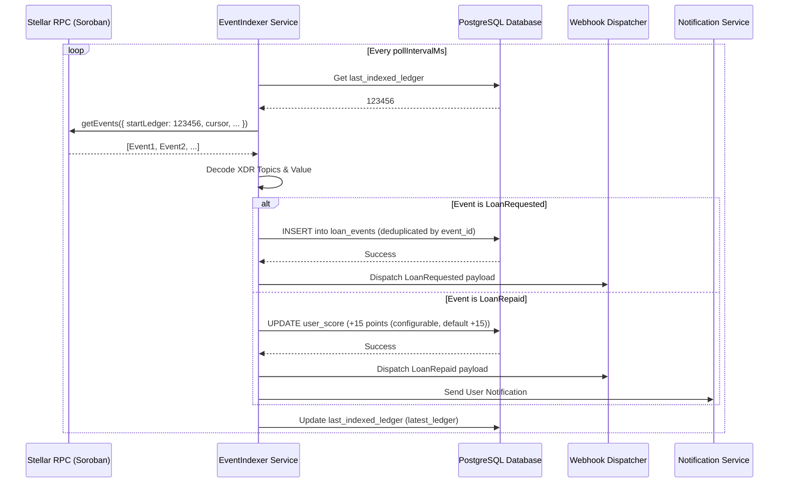

# Indexer <-> Database Sync Flow

This document explains how Remitlend synchronizes on-chain Soroban events with the off-chain PostgreSQL database for fast querying and credit score updates.

## Role of the Event Indexer

The `EventIndexer` service in the backend acts as a bridge. It polls the Stellar RPC node for contract events, decodes them, and stores the relevant data in our local database. It also handles webhook dispatch and notification side effects when critical events occur.

## Synchronization Workflow

## Implementation Details

### 1. Polling Mechanism
The indexer runs as a background process (`indexerManager.ts`) that initiates periodically based on the `INDEXER_POLL_INTERVAL_MS` environment variable (default: 30 seconds).

### 2. Event Decoding
- **Topics**: Decoded from XDR base64 using `stellar-sdk`. 
    - `topic[0]`: Event Type (e.g., `LoanRequested`)
    - `topic[1]`: Borrower Address
    - `topic[2]`: Loan ID (u32)
- **Value**: Decoded from XDR base64 based on the event type (e.g., `amount` for `LoanRequested`).

### 3. Database Schema
- **indexer_state**: Tracks the current synchronization point (`last_indexed_ledger` as the primary progress column, with cursor as secondary).
- **loan_events**: Stores every decoded event for auditing and history.
- **scores**: Maintains the current credit score for each user, updated in real-time by the indexer.

### 4. Side Effects & Integrations
- **Webhook Dispatch**: Once an event is successfully stored or processed in the database, the indexer triggers a webhook payload to registered external services.
- **Notifications**: Users are notified immediately (e.g., via email or push) after specific events like `LoanRepaid`, `LoanApproved`, or `LoanDefaulted` are successfully processed.

### 5. Resiliency & Reliability
- **Ledger Persistence**: The indexer always persists the `last_indexed_ledger` after successfully processing a batch of events, ensuring it resumes exactly where it left off. The `cursor` is only used to paginate within a single batch.
- **Deduplication**: We handle overlapping events or RPC retries by using `ON CONFLICT (event_id) DO NOTHING`. This ensures idempotency even if the same ledger range is processed twice.
- **Transactions**: Event storage and score updates are wrapped in a database transaction to ensure atomicity.
- **Failure and Resume Behavior**: If the indexer crashes or the RPC node times out mid-batch, the `last_indexed_ledger` is not updated. On restart, the indexer queries the last successfully saved ledger and resumes polling from that exact point, relying on deduplication to safely skip any partially processed events.

## Key Files
- `backend/src/services/eventIndexer.ts`: Core logic for polling, cursor persistence, deduplication, webhooks, and notifications.
- `backend/src/services/indexerManager.ts`: Lifecycle management for the indexer.
- `backend/src/db/connection.js`: Database connection and query execution.
